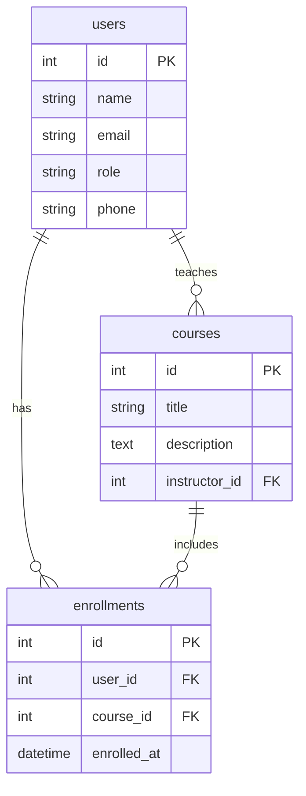

## Learning Portal - Data Model

Given below is the database schema used in the Learning Portal backend. It supports basic user, course and enrollement management functionalities.

### Table Definitions

#### users

- `id`: Primary key
- `name`: Full name
- `email`: Unique email
- `role`: Oneof `student`, `instructor` or `admin`
- `phone`: Optional phone number

#### courses

- `id`: Primary key
- `title`: Course name
- `description`: Optional details
- `instructor_id`: Foreign key → `users.id` (instructor)

#### enrollments

- `id`: Primary key
- `user_id`: Foreign key → `users.id` (student)
- `course_id`: Foreign key → `courses.id`
- `enrolled_at`: Timestamp (auto-generated)

### User Roles

The `users` table stores all system users, including students, instructors, and administrators. The `role` field defines the user type and determines access level in the system.

#### Supported Roles

| Role         | Description                                                          |
| ------------ | -------------------------------------------------------------------- |
| `student`    | A learner who can enroll in courses.                                 |
| `instructor` | A teacher who can create and manage courses.                         |
| `admin`      | A system administrator who can manage both students and instructors. |

#### Admin Capabilities

Admins are represented in the same `users` table and differentiated by the `role = 'admin'`.

The admin user is capable of:

- Creating, editing, or deleting user accounts (students/instructors)
- Viewing all courses and enrollments
- Performing system-wide audits or administrative tasks

No separate `admins` table is needed — this role-based distinction is handled within the unified `users` table for simplicity and scalability.
